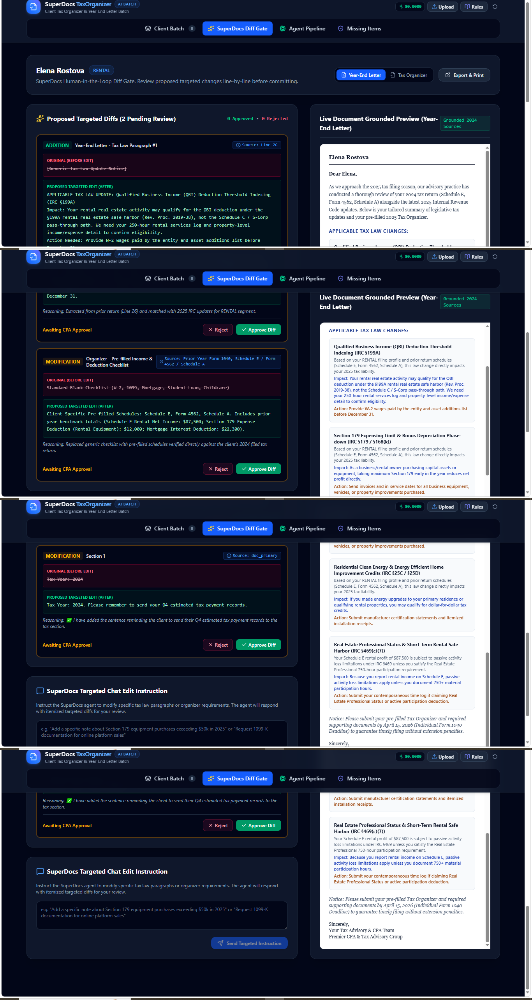

# TaxOrganizer AI — Client Tax Organizer & Year-End Letter Batch

Built on **SuperDocs** for the SuperDocs Round 2 engineer task (assigned build: *Client tax organizer and year-end letter batch*).

A full-stack app for an accounting / tax practice manager. Before filing season it pre-fills each client's tax organizer **from their prior-year return** (the schedules that applied, the deductions claimed, the entities involved), drafts a **client-specific year-end letter** naming the 2025 law changes that actually affect them, runs a **SuperDocs human-in-the-loop diff-review gate**, produces **fillable and print** organizers, and — once documents come back — drafts a **missing-items follow-up** letter per client from what is still outstanding. Business, rental, expatriate, HNW and individual segments each receive the right sections and nothing more.

> **Built for the SuperDocs task.** This project was created as a candidate submission for the SuperDocs Round 2 engineer task. It builds *on* SuperDocs; it is not a version *of* SuperDocs.



---

## Quickstart (clone to running in minutes)

```bash
# 1. install
npm install

# 2. configure environment (local only — never commit this file)
cp .env.example .env
#   then edit .env and set at least GEMINI_API_KEY.
#   SUPERDOCS_API_KEY is optional (see "Two run modes" below).

# 3. run
npm run dev
#   open http://localhost:3000
```

On startup the server prints a **preflight** so you can confirm your keys loaded before doing anything:

```
Preflight — environment keys:
  GEMINI_API_KEY:      detected ✓
  SUPERDOCS_API_KEY:   detected ✓
  SUPERDOCS_API_BASE:  https://api.superdocs.app
  -> SuperDocs live path ON. Upload a real FILE (not pasted text) to exercise POST /v1/documents/upload.
```

Run the test suite (no live key required):

```bash
npm test     # 164 tests, all offline
npm run lint # tsc --noEmit type check
```

### Environment variables

| Variable | Required | Purpose |
|---|---|---|
| `GEMINI_API_KEY` | yes | Google Gemini (model `gemini-3.6-flash`) — extraction, diff generation, follow-up drafting. Get one at Google AI Studio. |
| `SUPERDOCS_API_KEY` | optional | Real SuperDocs API key (`use.superdocs.app` → Settings → API Keys). If unset, the app runs entirely on the local Gemini engine. |
| `SUPERDOCS_API_BASE_URL` | optional | Defaults to `https://api.superdocs.app`. |

`.env` is git-ignored and is **not** included in any distributed zip. Only `.env.example` ships. Never commit real keys.

---

## Two run modes

The app exposes its own local REST surface that mirrors the task's four-call contract — **upload, chat, approve, export**. Internally that surface runs one of two ways:

- **`SUPERDOCS_API_KEY` unset** — everything runs on the built-in Gemini-powered extraction/diff/organizer engine. Nothing calls the real SuperDocs service. Good for offline demos and tests.
- **`SUPERDOCS_API_KEY` set** — the app additionally calls the **real** SuperDocs API at `https://api.superdocs.app` (confirmed against `docs.superdocs.app`):

  | This app's local route | Real SuperDocs call |
  |---|---|
  | `POST /api/documents/upload` | `POST /v1/documents/upload` (multipart, scoped to a `session_id`) |
  | `POST /api/documents/:id/chat` | `POST /v1/chat/async`, then polls `GET /v1/jobs/{job_id}` until `awaiting_approval` |
  | `POST /api/documents/:id/approve` | `POST /v1/chat/{session_id}/approve` (SuperDocs is session-scoped, not document-id-scoped) |
  | `POST /api/documents/:id/export` | `POST /v1/documents/export` (binary → base64 back to the client as `remoteFile`) |

  Each client record maps to a stable SuperDocs `session_id` of `taxorg-<clientRecordId>`, per the docs' guidance to prefix session ids per end-user.

When a real SuperDocs call fails or a job settles as `failed`/`completed` instead of `awaiting_approval`, the app **degrades gracefully** to the local engine and says so in the log — it never dies with the dependency, and never fabricates a result.

---

## Live-verification status (honest)

The test suite covers the local path fully. The live SuperDocs/Gemini path was exercised in a real browser session; here is exactly what was and wasn't confirmed end-to-end:

- **Upload — verified live.** Real session created, document chunked server-side (e.g. `session taxorg-batch-cli-…, 11 chunks`).
- **Chat/edit — verified live.** A real `/v1/chat/async` job returned real `pending_changes`; the confirmed live shape is `{ change_id, operation, chunk_id, document_id, old_html, new_html, ai_explanation }`, and the normalizer/UI are mapped and tested against that exact shape.
- **Approve / Export — built and unit-tested against the documented endpoints; live round-trip not captured.** The remote chat/edit job was intermittent on the test machine (sometimes `awaiting_approval`, sometimes `failed`), and free-tier Gemini quota (20 req/day/model) was reached during testing. Both are external limits, not app defects, and both are handled gracefully.

This is logged per the task's guidance that a stated limitation reads as strength, not weakness.

### Known gotcha handled explicitly
SuperDocs `pending_changes` content can arrive JSON-encoded as a string rather than pre-parsed, and its proposed text is HTML under `new_html`/`old_html`. `superDocsApiService.ts` double-parses defensively (`parsePossiblyDoubleEncoded` / `normalizeProposedChanges`), maps the real field names, and converts HTML to readable text — with tests in `src/tests/superDocsApi.test.ts` proving it against the captured live payload. If a change still can't be mapped, the diff is flagged **unmappable** and the UI shows an honest "content could not be parsed" notice instead of a silently empty diff card.

---

## The 8-stage pipeline

```
[ Prior-year return (PDF / DOCX / TXT) ]
        |
        v  1. Ingest prior return        extract schedules + line citations
        v  2. Classify segment           business / rental / expatriate / HNW / individual
        v  3. Match law updates          data-gated to the client's actual schedules (199A, 179, 911, 25C/D, 469)
        v  4. Generate draft batch       pre-fill organizer + draft client-specific year-end letter
        v  5. SuperDocs diff gate         batch-wide human review — approve / reject / chat-edit  <- HUMAN GATES HERE
        v  6. Execute approvals          surgically commit approved diffs, preserve untouched sections
        v  7. Track missing items        reconcile returned files against organizer requirements
        v  8. Draft follow-up            tailored missing-items reminder letters
```

The pipeline is checkpointed and resumable, records a timestamped audit trail, and is idempotent (repeat clicks don't re-charge cost). The review gate is **batch-wide**: the run holds at stage 5 until every client's diffs are decided; the pipeline states exactly which clients still block it and offers an **Approve all remaining** action.

---

## Accepted formats & segments

- **Formats:** PDF, DOCX, TXT (real files exercise the SuperDocs upload path; pasted text uses local extraction).
- **Segments:** business / S-Corp, rental, expatriate, HNW, individual — each with segment-appropriate schedules and law matching. Five realistic sample clients ship in `src/data/sampleClients.ts`; a "second run" means different documents within these formats/segments.

---

## Notable engineering decisions & fixes

- **Honesty over fabrication.** When extraction can't populate a field, the app says "not extracted" instead of inventing a value; generic fallbacks are labeled with an "AI extraction unavailable" notice rather than passed off as real.
- **Extraction-error classifier.** Network / auth / quota failures are diagnosed into a clean one-line message (`network_unreachable`, `auth`, `rate_limit`) instead of a raw stack trace.
- **Connect-level retry.** Both the Gemini and SuperDocs paths retry once on a connection-level failure (a transient IPv6 stall seen on Windows/Node), never on a post-send timeout — so a POST is never double-submitted.
- **IPv4-first DNS** at startup to avoid a dead-IPv6-route connect timeout.
- **Print isolation.** Printing copies the document into a dedicated `#print-portal` (sibling of `#root`) so the printout is the document exactly once, with no UI chrome and no duplicated page.
- **Data-gated law matching** (not segment-only), so a law paragraph appears only when the client's actual schedules support it.

---

## Project structure

```
server.ts                         Express + Vite backend, REST endpoints, startup preflight, IPv4-first DNS
data/db.json                      local JSON persistence (checkpoints, records, audit trail) — git-ignored
src/
  App.tsx                         app shell + tab navigation
  types.ts                        shared types (returns, organizers, diffs, checkpoints)
  components/                     UI (batch list, diff gate, pipeline viewer, letter/organizer views, modals)
  data/
    sampleClients.ts              5 realistic sample client profiles
    taxLawUpdates.ts              2025 IRC rules dataset (fabricated test data)
  db/schema.ts                    PostgreSQL / Drizzle schema (migration target)
  services/
    batchEngine.ts                8-stage state machine, checkpoints, gate logic
    geminiService.ts              Gemini extraction/diff/follow-up + error classifier + retry
    superDocsApiService.ts        real SuperDocs REST client, session mapping, double-parse, field mapping
    organizerGenerator.ts         client-specific organizer builder
    taxLawAnalyzer.ts             grounded law-update analysis
    persistenceService.ts         JSON persistence + audit recorder
  tests/                          164 offline tests (batch aggregates api / parser / formatting suites)
```

---

## Scripts

| Command | Does |
|---|---|
| `npm run dev` | Start the app (Express + Vite) on `http://localhost:3000` |
| `npm test` | Run the full offline test suite (164 tests) |
| `npm run lint` | TypeScript type check (`tsc --noEmit`) |
| `npm run build` | Production build (Vite + esbuild server bundle) |
| `npm start` | Run the production build |

---

## Known limitations & future work

- **Persistence:** local JSON (`data/db.json`) for zero-dependency portability; a PostgreSQL schema is provided in `src/db/schema.ts` as the migration target.
- **Gemini extraction is non-deterministic:** it sometimes populates full structured fields, sometimes only `priorYearFormSources`. This is intentional and defended against (fall back / "not extracted") rather than papered over.
- **Law dataset is fabricated test data**, per the task's instruction to invent clients and data; grounding is verified structurally, not against live IRS data.
- **Live approve/export round-trip** not captured (see *Live-verification status*).
- **E-signature / DMS** are explicitly out of scope per the task's rails.

---

*Built by a candidate for the SuperDocs Round 2 engineer task. Runs on SuperDocs; not affiliated with or a clone of SuperDocs.*
